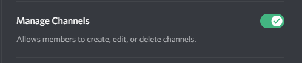

# Command: autosetup
---
### What does it do?
This command allows admins to automatically setup the bot in their server, by creating useful channels in the server:

**Suggester will create 4 channels and 1 category in your server:**
- The first channel will host [approved suggestions](/config/suggestions.md), any idea you choose to approve will be posted there for people to vote on.
- The second one will be used for [denied suggestions](/config/denied.md): bad ideas, spam, people begging for free cookies or whatever, all suggestions you decide to deny will be sent there (unless you prefer them to stay in the dark by [silent-denying](staff/silentdeny.md) them 👀).
- The third one is the coolest because it will be used to choose a stance on new suggestions, you'll be able to approve or deny them and optionally add a comment.
- Lastly, a new channel will be created to have eyes on everything. Well, at least what Suggester does in your server, read more about suggestion logs [here](/config/logs.md). 

?> If you are looking for more granular options, take a look at the [config](config/configuration.md) command!

### Usage
Run `.autosetup` in any channel the bot can read and send messages in

### Alias
`autoconfig`

### User Permission
To execute this command, the user must have the **Manage Server** permission or a configured [admin](/config/adminroles.md) role

### Bot Permission
To execute this command, Suggester will need the **Manage Channels** permission:

?> If you have configured a server-wide [language](/config/locale.md), the names of the created channels will be set accordingly. If they still appear in english, it means the corresponding strings have not yet been translated.

