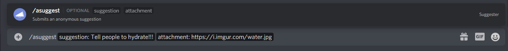

# Anonymous Suggestions
They're finally here! Server members can now remain anonymous when suggesting something in your server by using the new `/asuggest` command! 

Yes, you did see a slash. Discord recently introduced the ability for developers to implement their bot's commands into the client so users can get walked through directly from the chat box, how amazing? You can learn more about Slash Commands in general [here](https://support.discord.com/hc/en-us/articles/1500000368501)

### Introduction
In order to use slash commands, you'll need to re-invite Suggester using [this link](https://suggester.js.org/invite). 
In short, the above link will give Suggester a new permission to create Slash Commands in your server, which means even if the bot is already in the server, you'll need to use the link. But don't panic, no data will be lost. Once Suggester gets this new permission, typing `/` in the chat bar will show a popup menu as shown below:

 
### Behavior
Anonymous suggestions are **disabled by default**, but you can enable them using `.config anon on`. To send an anonymous suggestion, simply type `/` in the chat bar, click on the `/asuggest` command and fill in the arguments with your suggestion details (you can add an attachment by clicking on the `attachment` button and using a link).

They show as anonymous in the suggestions feed and public info commands (such as `.shortinfo`), but members with staff permissions (`.cfg staff`) can view the user who submitted them for moderation purposes. 

The slash command used to submit an anonymous suggestion shares the same behavior as the regular suggest command, any configuration errors or configured submission restrictions are applied (suggestion cap, blocked roles, cooldown, etc..)

 
> Please let us know if you find any bugs or have feedback about this implementation by joining our [support server](https://suggester.js.org/support)!
