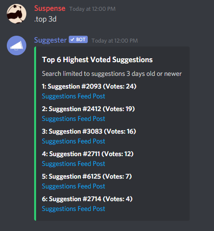

# The Top & Down Commands
---
### Description
These two commands allow you to massively gather feedback from your community, based on your approved suggestions in your server. The `top` and `down` commands respectively show the most popular and the less upvoted suggestions on your server.

### Usage
Use `.top (time)` or `.down (time)` in any channel the bot can read and send messages in.

### Arguments
`(time)`: The period of time you want to search suggestions from (see examples below)

### Example

> Use `m` for minutes, `h` for hours, `d` for days and `w` for weeks

### Aliases
top: `best`, `upvoted` and `upvotes`\
down: `downvoted`, `worst` and `lowest`

### User Permission
To execute this command, the user must have the **Manage Server** permission or a configured [staff](/config/staffroles.md) role.
