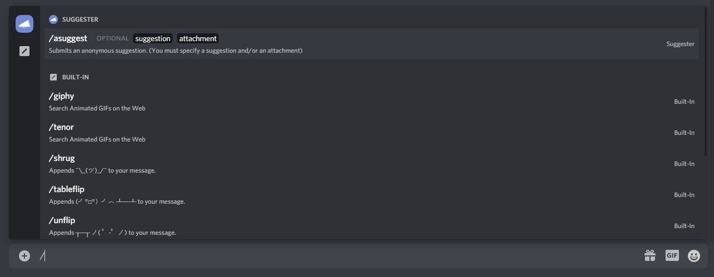

# Anonymous Suggestions
Server members can now remain anonymous to other server members when suggesting something in your server by using the `/asuggest` (slash) command! 

Yes, you did see a slash. Discord introduced the ability for developers to implement their bot's commands into the client so users can get walked through directly from the chat box, how amazing? You can learn more about Slash Commands in general [here](https://support.discord.com/hc/en-us/articles/1500000368501).

### Introduction
Typing `/` in the chat bar will show a list of available commands for bots that support slash commands. Currently, Suggester only supports `/asuggest` as a slash command, but wider support will hopefully be available in the future.

### Behavior
Anonymous suggestions are **disabled by default**, but you can enable them using `.config anon on`. To send an anonymous suggestion, simply type `/` in the chat bar, click on the `/asuggest` command and fill in the arguments with your suggestion details. You can add an attachment by clicking on the `attachment` button and pasting a link.

They show as anonymous in the suggestions feed and public info commands (such as `.shortinfo`), but members with staff permissions (`.cfg staff`) **can view the user who submitted them** for moderation purposes. 

The slash command used to submit an anonymous suggestion shares the same behavior as the regular suggest command, any configuration errors or configured submission restrictions are applied (suggestion cap, blocked roles, cooldown, etc..)

> Please let us know if you find any bugs or have feedback about this implementation by joining our [support server](https://suggester.js.org/support)!
