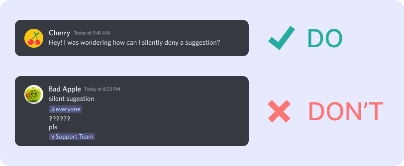

# Support Guidelines

Our [support server](https://suggester.js.org/support) is a place for you to get help with Suggester and its related services. Interacting with our team is governed by a set of simple rules listed below that we ask everyone to follow. Additionally, our team is mainly based in Europe, so it might take several hours to get back to you during the night.

### Guidelines
• Stay polite and respectful at all times\
• Provide a detailed description of your issue\
• Remain patient and don't abuse pings, opening a ticket already notifies us\
• Avoid using the reply feature on the latest message in chat\
• Only open a ticket if you need help with Suggester

