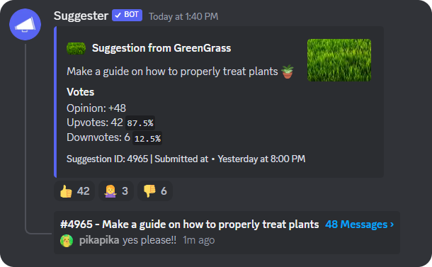

# ✨ Threaded, an add-on to Suggester 
Threaded is an extension to Suggester that automatically creates threads on new approved suggestions.

## Configuration
To setup the bot, simply add "`[t]`" to the topic of your suggestion channel (Edit Channel > Channel Topic) and make sure it has the **Create Public Threads** permission in that same channel. Once you've done that, a thread will be created on each new suggestion! 

If you delete a suggestion, Threaded will automatically close and lock the thread if it has the **Manage Threads** permission in the channel.

If you're experiencing issues with the bot, you can use the `/troubleshoot` command to find a potential cause. If the problem persists, or you want to give feedback, feel free to hop in the [support server](https://suggester.js.org/support) and open a ticket, making sure to mention that you're asking about Threaded.

## Add the bot to your server
This is an extension to Suggester, which means this feature is not currently available natively. In order to use it, you need to [add Threaded to your server](https://discord.com/api/oauth2/authorize?client_id=1127542127191150643).

